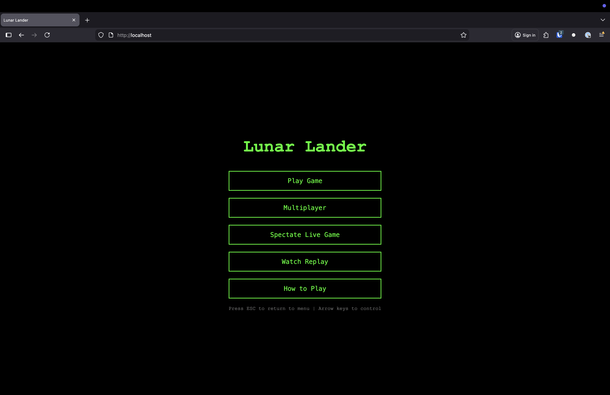
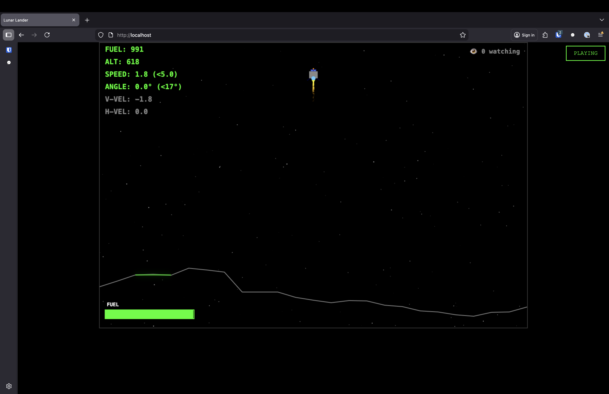
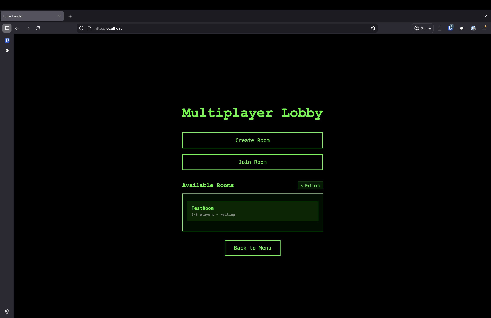
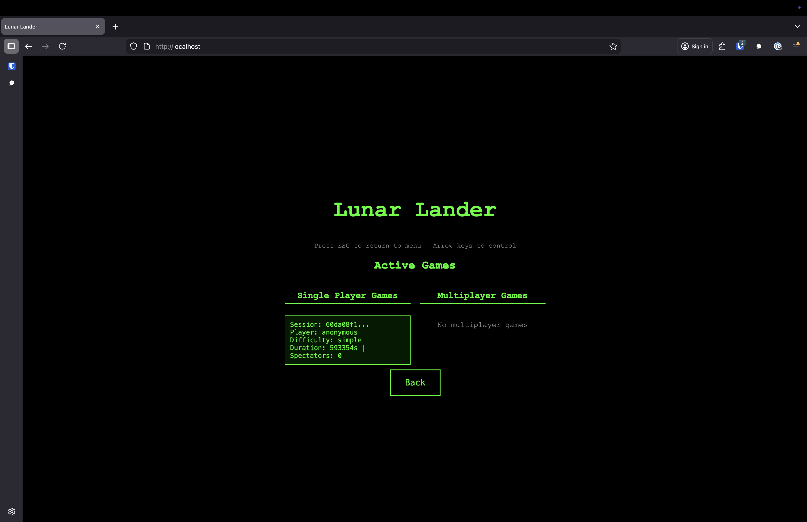

# 🌙 Lunar Lander — BSidesKC 2026

**Build an AI that lands on the Moon. Compete against humans and other bots.**


---

## The Challenge

Lunar Lander is a real-time physics game inspired by the 1979 Atari classic. Your mission: write a bot that connects via WebSocket, reads telemetry, and safely lands on the lunar surface.

The catch? Gravity is constant, fuel is finite, and the terrain is unforgiving.

- 🎮 **Humans play in the browser** — arrow keys to thrust and rotate
- 🤖 **Bots play via WebSocket API** — any language, any strategy
- 📊 **Everyone shares one leaderboard**

## Playing in the Browser

No code required — just open the game server URL and play.

### Controls

| Platform | Thrust | Rotate Left | Rotate Right |
|----------|--------|-------------|--------------|
| Desktop | ↑ or W | ← or A | → or D |
| Mobile | Left thumb button | Right thumb buttons | Right thumb buttons |

Mobile controls are swappable (thrust left/right) — tap the swap icon in-game.

### Screenshots

| Main Menu | Gameplay |
|-----------|----------|
|  |  |

| Multiplayer | Spectate |
|-------------|----------|
|  |  |

---

## Building a Bot

Don't want to fly by hand? Write code that flies for you.

### Quick Start

#### 1. Register

Visit the game server in your browser and create an account. Once logged in, go to your profile to create a bot and get your API key.

#### 2. Connect and Fly

```python
import asyncio, json, websockets

async def play():
    async with websockets.connect(
        "wss://SERVER_URL/ws",
        additional_headers={"X-API-Key": "YOUR_BOT_API_KEY"}
    ) as ws:
        await ws.send(json.dumps({"type": "start", "difficulty": "simple"}))
        init = json.loads(await ws.recv())

        while True:
            msg = json.loads(await ws.recv())
            if msg["type"] == "telemetry":
                lander = msg["lander"]
                if lander["vy"] > 3.0:
                    await ws.send(json.dumps({"type": "input", "action": "thrust"}))
            elif msg["type"] == "game_over":
                print(f"{'LANDED' if msg['landed'] else 'CRASHED'} — Score: {msg.get('score', 0)}")
                break

asyncio.run(play())
```

That's it. You're flying.

## Documentation

| Doc | Description |
|-----|-------------|
| [Bot API Reference](docs/BOT_API.md) | Full WebSocket protocol, endpoints, message formats |
| [Scoring](docs/SCORING.md) | How points are calculated |
| [Examples](examples/) | Working bot implementations to get you started |

## Server URL

The game server will be live at the conference. URL will be announced at the event.

<!-- TODO: Update with actual server URL -->

## Rules

1. **One player account per person.** You can register up to 10 bots under your account.
2. **Any language, any framework.** If it speaks WebSocket, it can play.
3. **No attacking the server.** Rate limits are enforced. Play the game, not the infrastructure.
4. **Leaderboard is cumulative.** Your best score across all your bots counts.
5. **Have fun.** This is a hacking conference. Get creative.

## Scoring

| Component | Points | How |
|-----------|--------|-----|
| Base (successful landing) | 1,000 | Land safely |
| Fuel bonus | 0–500 | More fuel remaining = more points |
| Time bonus | 0–300 | Faster landing = more points |
| Difficulty multiplier | 1.0x / 1.5x / 2.0x | Easy / Medium / Hard |

**Maximum possible: 3,600 points** (perfect hard landing)

Crash = 0 points. See [full scoring details](docs/SCORING.md).

## Landing Criteria

Your lander must touch down on a landing zone with:
- Speed < **5.0 m/s**
- Angle < **17°** from vertical

Miss the zone, come in too fast, or tip over — you crash.

## Tips

- Telemetry arrives at **60Hz** — you don't need to respond to every frame
- `vy` is positive downward — higher = falling faster
- Start with `simple` difficulty to get your bearings
- Watch your fuel — short thrust bursts are more efficient than constant burn
- Use the spectator mode to watch other bots and learn from their strategies

## License

MIT
